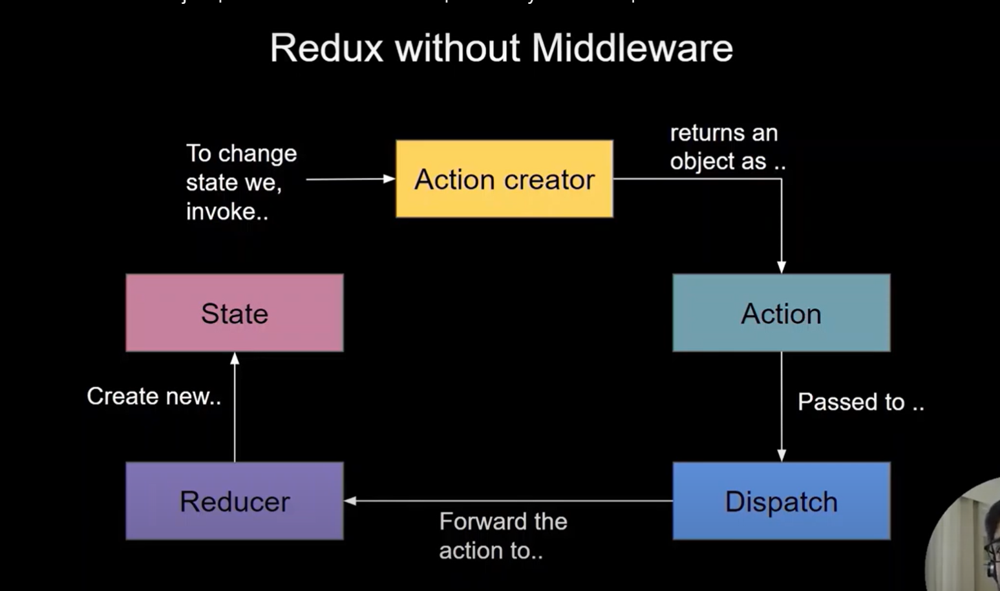
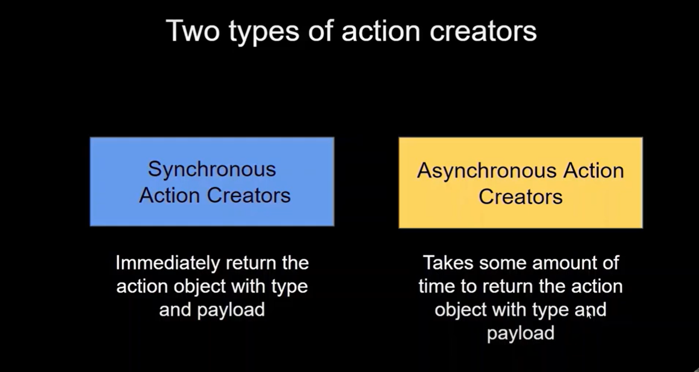
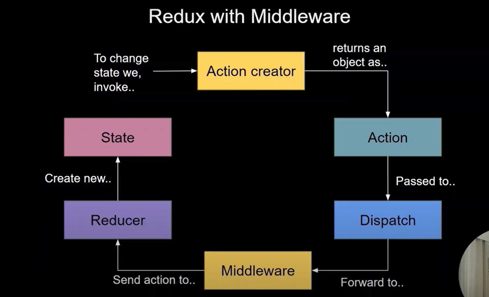

React - redux

npm i redux react-redux

folder for redux

1. redux
	a. containers [folder]
	b. actions [folder]
	c. reducers [folder]
	d. store.js [file]

step 1 :- create constants
step 2 :- create action
step 3 :- create reducer (in my case that is product)
step 4 :- create index (reducer's main file)
	using combineReducers from redux

	import { combineReducers } from "redux";
	import {productReducer} from './productReducer'

	const reducers = combineReducers({
    		allProducts : productReducer
	})

step 5 :- create store

	import {createStore} from 'redux'
	import reducers from './reducers/index'

		const store = createStore(
    			reducers,
    			{},
 			window.__REDUX_DEVTOOLS_EXTENSION_COMPOSE__ && window.__REDUX_DEVTOOLS_EXTENSION_COMPOSE__()
    		)

	export default store;
	

step 6 :- in main.jsx provide store to the react application using react provider

********Why do we need to use thunk ?
thunk is the middleware in the redux :- we can call api here

as i am calling the api in the actions without using the thunk : error :- page.bundle.js:1 Uncaught Error: Actions must be plain objects. Use custom middleware for async actions.

i need to convert my synchronous action creator to asynchronous action creator

for that the thunk will be in used
middleware has the power to get the dispatch data (call) and hold until middleware doesn't receive the data from the api and all then it dispatch retrived data reducer

before middleware

 
using middleware

 
Using middlware :- data flow 

 
Installation of the middleware
1.	npm i redux-thunk

2. integrate redux thunk in the store

action using middleware thunk

// async action creator 
export const fetchProductAction = () => {
    //middleware to make the asynchronous api call
    return async (dispatch) => {
        const response = await fakeApi.get("/products")
        dispatch({type : productActionTypes.FETCH_PRODUCTS, 
            payload : response.data
        })
    }
}

then disptach the data from the components

####CONVERTING INTO SLICES 
for
	✔ Less Boilerplate → No need to define action types, action creators, and reducers separately.
	✔ Better Performance → Uses Immer.js for immutable state updates.
	✔ Built-in Async Handling → Works seamlessly with createAsyncThunk.